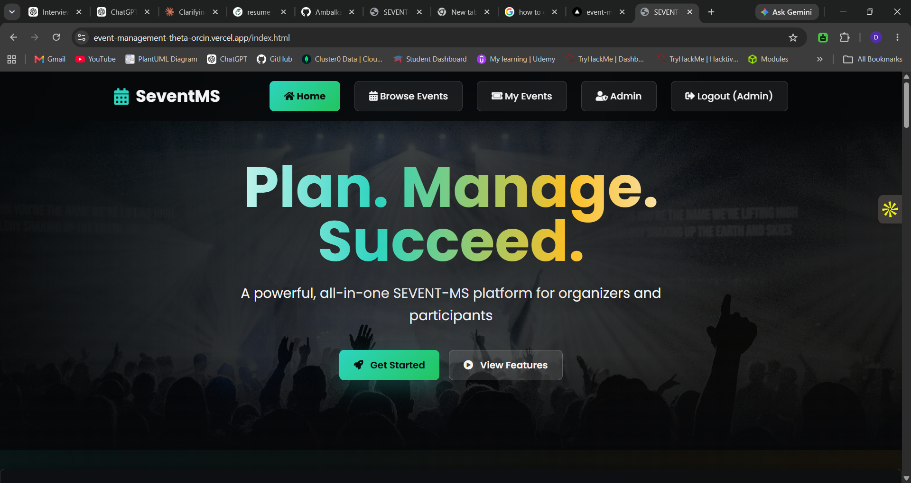
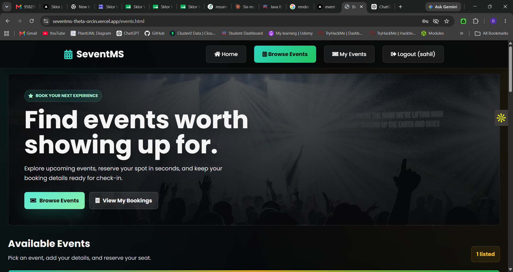
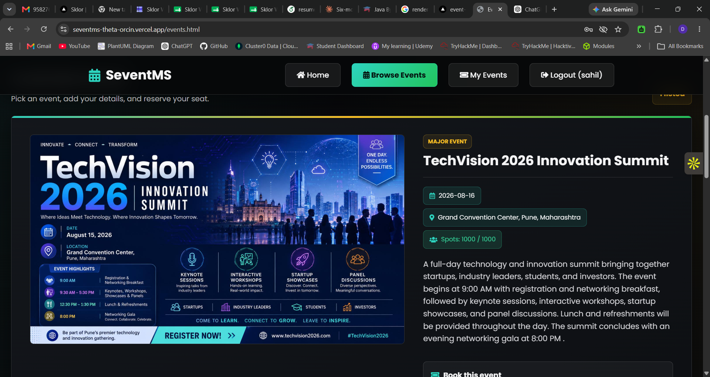
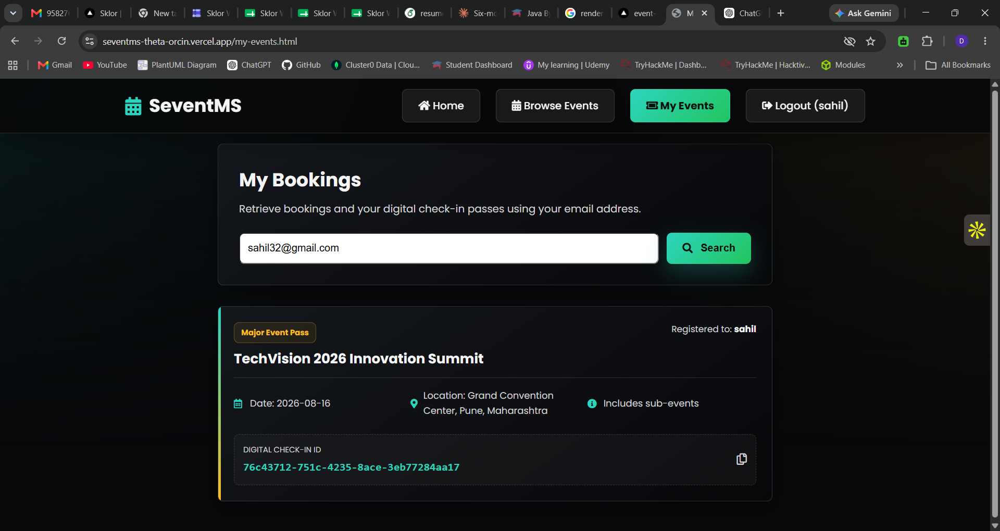
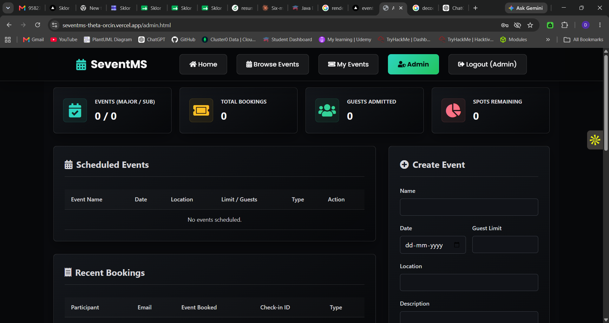

# SEVENT-MS

SEVENT-MS is a Java 17 event management web application for creating events, publishing them to users, collecting bookings, and tracking registrations. It uses Spring Boot, JSP views, JDBC-based controllers, PostgreSQL, and Maven. The project also includes a simple frontend build, Docker support, and deployment files for common platforms.

## Screenshots

The latest local screenshots are stored in `uploads/images/events/` and are used here instead of the older remote images.








## What The App Does

- Public landing page with project and developer details.
- User-facing event browsing and booking.
- Admin event creation and management.
- Event types including simple events, major events, and sub-events.
- Booking records with participant name, email, booking date, and generated digital ID.
- "My Events" lookup by participant email.
- Image uploads for event branding and cards.
- Health check endpoint for deployment platforms.

## Main Features

- Browse events from the user area at `/user`.
- Book available events and store booking details in PostgreSQL.
- Search a participant's bookings at `/myEvents`.
- Manage events from the admin dashboard at `/admin`.
- Upload event images that are stored under `uploads/images/events`.
- Support for parent and child events through the `parent_event_id` relationship.
- Capacity tracking with support for "housefull" behavior.
- Local development support through Maven, Docker Compose, and `run-dev.bat`.

## Tech Stack

- Java 17
- Spring Boot 2.7.x
- Spring MVC
- JSP and JSTL
- JDBC / direct SQL usage
- PostgreSQL
- Maven
- Docker and Docker Compose

## Project Layout

```text
SEVENT-MS/
|-- src/main/java/
|   |-- com/eventms/
|   |   |-- auth/
|   |   |-- config/
|   |   |-- controller/
|   |   |-- service/
|   |   `-- util/
|   `-- com/example/eventmanagement/
|       |-- model/
|       |-- servlet/
|       `-- util/
|-- src/main/resources/
|   |-- application.properties
|   |-- postgres_schema.sql
|   |-- h2_schema.sql
|   |-- database_schema.sql
|   |-- database_setup.sql
|   `-- import.sql
|-- src/main/webapp/
|   |-- WEB-INF/views/
|   |   |-- admin_dashboard.jsp
|   |   |-- auth.jsp
|   |   |-- user_events.jsp
|   |   |-- my_events.jsp
|   |   `-- error.jsp
|   |-- images/
|   |-- css/
|   `-- documentation.jsp
|-- uploads/
|   `-- images/events/
|-- frontend/
|-- docker-compose.yml
|-- Dockerfile
|-- render.yaml
|-- railway.toml
|-- run-dev.bat
`-- pom.xml
```

## Application Routes

| Route | Purpose |
| --- | --- |
| `/` | Landing page. |
| `/login` | User and admin login page. |
| `/signup` | User registration page. |
| `/user` | Browse available events and book them. |
| `/myEvents` | Search bookings by email. |
| `/admin` | Admin dashboard for managing events and bookings. |
| `/documentation.jsp` | In-app documentation page. |
| `/health` | Health check endpoint. |

## Authentication

The app has two separate credential paths:

- Spring Security default user credentials, configured from environment variables in `application.properties`.
- Custom admin login, which checks `admin.email` and `admin.password.hash`.

Current defaults are defined in:

- [`src/main/resources/application.properties`](src/main/resources/application.properties)
- [`.env.example`](.env.example)

## Configuration

### Database

The app reads database settings from environment variables with local defaults:

```properties
SPRING_DATASOURCE_URL=jdbc:postgresql://localhost:5432/event_ms_db
SPRING_DATASOURCE_USERNAME=postgres
SPRING_DATASOURCE_PASSWORD=postgres
SPRING_PROFILES_ACTIVE=default
```

### Security and Admin Settings

```properties
SPRING_SECURITY_USERNAME=admin
SPRING_SECURITY_PASSWORD=admin
ADMIN_EMAIL=admin@eventms.com
ADMIN_PASSWORD_HASH=<bcrypt-hash>
```

### File Uploads

Uploaded event images are written to:

```text
uploads/images/events/
```

These files are exposed through the app as `/images/events/**`.

## Local Development

### Prerequisites

- Java 17 or later
- Maven or the included Maven wrapper
- PostgreSQL, Docker Compose, or the Windows development script

### Option 1: Docker Compose

Start the app and PostgreSQL together:

```bash
docker-compose up --build
```

Open:

```text
http://localhost:8080
```

### Option 2: Maven with PostgreSQL

Create a database named `event_ms_db`, then initialize the schema:

```bash
psql -U postgres -d event_ms_db -f src/main/resources/postgres_schema.sql
```

Build and run:

```bash
./mvnw.cmd clean package -DskipTests
java -jar target/SEVENT-MS.war
```

Open:

```text
http://localhost:8080
```

### Option 3: Windows Dev Script

`run-dev.bat` builds the app, prepares local dependencies, and starts the application on port `8081`.

```bat
run-dev.bat
```

Open:

```text
http://localhost:8081
```

## Database Schema

The main schema lives in `src/main/resources/postgres_schema.sql`.

Core tables include:

- `events`
- `bookings`
- `app_users`

The `events` table stores:

- event name
- event date
- location
- description
- capacity limit
- current attendee count
- event type
- parent event relationship
- image path

The `bookings` table stores:

- participant name
- participant email
- event reference
- booking type
- generated digital ID
- booking timestamp

The `app_users` table is created on demand for user signup and login.

## Build

Create the WAR file:

```bash
./mvnw.cmd clean package -DskipTests
```

The output is created at:

```text
target/SEVENT-MS.war
```

## Deployment

### Docker

```bash
docker build -t sevent-ms .
docker run -p 8080:8080 \
  -e SPRING_DATASOURCE_URL=jdbc:postgresql://host.docker.internal:5432/event_ms_db \
  -e SPRING_DATASOURCE_USERNAME=postgres \
  -e SPRING_DATASOURCE_PASSWORD=postgres \
  sevent-ms
```

### Render

This repository includes `render.yaml` and a `Dockerfile`.

Steps:

1. Create or connect a PostgreSQL database.
2. Create a web service from the repository.
3. Use the Docker runtime.
4. Set environment variables from `.env.example`.
5. Run `src/main/resources/postgres_schema.sql` if the tables are not already present.

### AWS

Use the guidance in `AWS_DEPLOYMENT.md` for App Runner, ECR, and RDS setup.

## Notes

- `SecurityConfig` currently permits all requests.
- The controllers use `DataSource`, `Connection`, and prepared SQL directly instead of a full repository/service split.
- Uploaded images live on the container filesystem by default, so durable storage should be planned for production.
- `spring.jpa.hibernate.ddl-auto=update` is enabled, but the SQL schema files remain the clearest source of truth for table structure.
- The `uploads/` folder is part of the running application state and may contain user-generated assets.

## Files To Know

- [`src/main/resources/application.properties`](src/main/resources/application.properties)
- [`src/main/resources/postgres_schema.sql`](src/main/resources/postgres_schema.sql)
- [`src/main/java/com/eventms/controller/AdminController.java`](src/main/java/com/eventms/controller/AdminController.java)
- [`src/main/java/com/eventms/controller/AuthController.java`](src/main/java/com/eventms/controller/AuthController.java)
- [`src/main/java/com/eventms/controller/ApiAuthController.java`](src/main/java/com/eventms/controller/ApiAuthController.java)
- [`src/main/java/com/eventms/config/WebConfig.java`](src/main/java/com/eventms/config/WebConfig.java)
- [`src/main/java/com/eventms/config/SecurityConfig.java`](src/main/java/com/eventms/config/SecurityConfig.java)

## Future Improvements

- Add real admin authorization and route protection.
- Add CSRF protection for browser flows.
- Add automated tests around bookings and capacity limits.
- Move direct SQL access into service/repository layers.
- Add upload storage to S3 or another durable object store.
- Add migration tooling such as Flyway or Liquibase.
